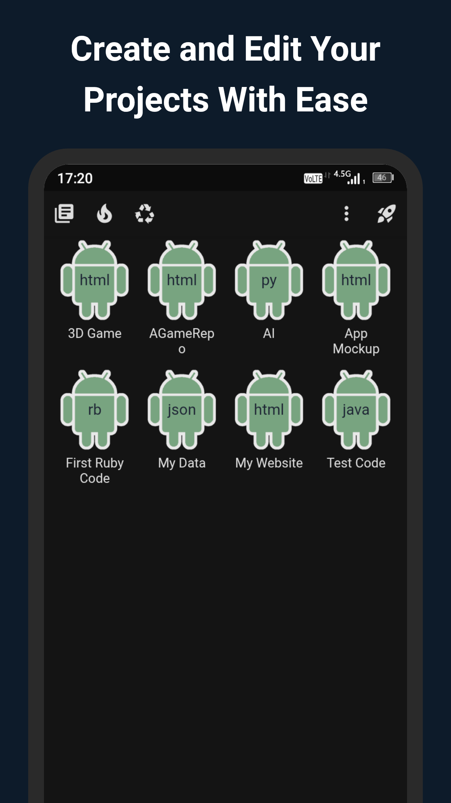
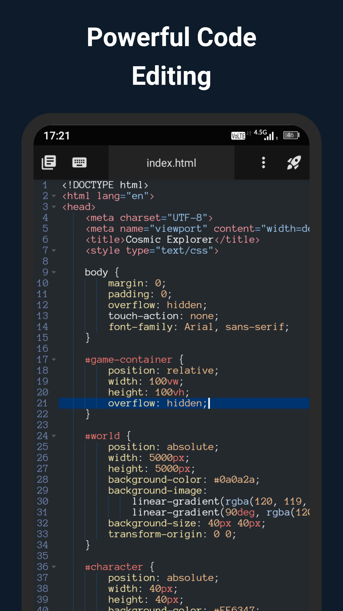
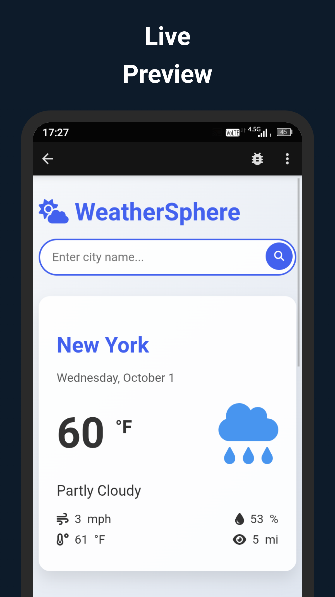
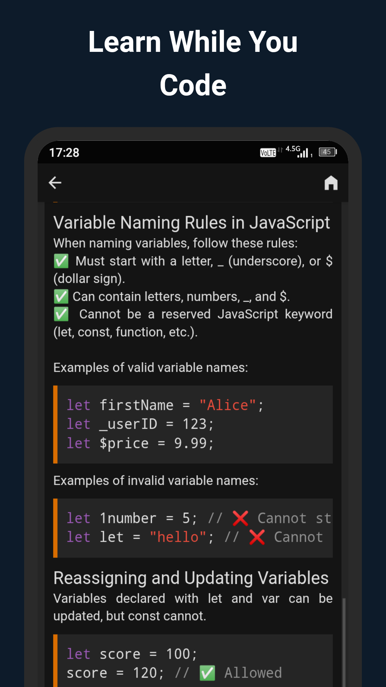

# CodeFlash - AI-Powered Code Optimization & Mobile Editor


CodeFlash is evolving into a comprehensive code optimization platform:

1. **🤖 AI-Powered Python Optimizer** - Automated code refactoring and performance optimization via GitHub Pull Requests
2. **📱 Mobile Code Editor for Android** - Fast, offline code editor with 200+ language support

---

## 🚀 AI-Powered Python Optimizer (NEW!)

CodeFlash now includes an AI-powered command-line tool that automatically identifies and fixes performance bottlenecks in your Python code, with a focus on cloud cost optimization.

### Key Features

- **💰 Cloud Cost Optimization**: Reduce AWS/GCP bills by 20%+ through intelligent memory optimization and dependency analysis
- **⚡ Speed Optimization**: Improve execution speed through algorithmic optimizations
- **🧠 Memory Optimization**: Reduce memory footprint for better scalability
- **🔀 Automated PR Generation**: Creates GitHub Pull Requests with detailed explanations
- **🎯 Multiple Optimization Goals**: Choose between speed, cost, or memory optimization

### Installation

```bash
pip install -e .
```

### Quick Start

```bash
# Optimize for cloud cost reduction
codeflash optimize ./src --goal=cost

# See what would be optimized (dry run)
codeflash optimize ./src --goal=cost --dry-run

# Create a GitHub PR with optimizations
codeflash optimize ./src --goal=cost --create-pr --repo=owner/repo

# Analyze a single file
codeflash analyze myfile.py
```

### Optimization Goals

- **`--goal=cost`** (💰): Reduces cloud computing costs by optimizing memory usage, suggesting lighter library alternatives, and improving resource efficiency
- **`--goal=speed`** (⚡): Improves execution speed through algorithmic optimizations and efficient data structures
- **`--goal=memory`** (🧠): Minimizes memory footprint for better scalability

### How It Works

1. **Analysis**: Scans your Python code using AST analysis to identify optimization opportunities
2. **AI-Powered Suggestions**: Provides detailed recommendations with impact analysis
3. **Safe Application**: Applies optimizations with clear explanations
4. **PR Generation**: Creates comprehensive Pull Requests with before/after comparisons

### Example Output

```
🚀 Codeflash v0.1.0
📂 Analyzing: ./src
🎯 Goal: cost

💰 Running Cloud Cost Optimization Analysis...

📊 Found 5 optimization opportunities:

1. src/data_processor.py:12
   Issue: Heavy import: pandas
   Impact: Increases memory footprint and cold-start time (Library is heavy)
   Suggestion: Consider lighter alternatives: csv (stdlib), polars (lighter & faster)

2. src/utils.py:45
   Issue: List comprehension could be a generator
   Impact: Stores entire list in memory (O(n) space)
   Suggestion: Use generator expression () instead of [] if only iterating once
```

### Roadmap

See the [Features Roadmap](#future-features) below for upcoming enhancements.

---

## 📱 Mobile Code Editor for Android

CodeFlash is a fast, offline, and powerful code editor designed specifically for Android devices. It provides a professional coding experience on your mobile device with support for 200+ programming languages, advanced features, and a clean, distraction-free interface.

## Features ✨

- **Mobile-Optimized**: Comfortable coding experience on phones and tablets
- **200+ Language Support**: Syntax highlighting for HTML, CSS, JavaScript, Python, Java, C++, and more
- **Offline Documentation**: Built-in coding references and tutorials
- **Customizable Interface**: Themes, font sizes, and keyboard settings
- **Run & Preview**: Execute and view outputs of HTML/CSS, JS, Python, and more
- **Lightweight**: Smooth performance even with large files
- **Project Management**: File organization and version history

## Download 📥

Get CodeFlash on Google Play:

[](https://play.google.com/store/apps/details?id=com.alonewolf.codeflash)

## Screenshots 📸

| | | |
|:-------------------------:|:-------------------------:|:-------------------------:|
|  |  |  |
|  |  |  |

## Technologies Used 🛠️

- **Frontend**: HTML5, CSS3, JavaScript
- **Icons**: Font Awesome
- **Hosting**: GitHub Pages

## Contributing 🤝

Contributions are welcome! If you'd like to improve the website:

1. Fork the repository
2. Create your feature branch (`git checkout -b feature/AmazingFeature`)
3. Commit your changes (`git commit -m 'Add some AmazingFeature'`)
4. Push to the branch (`git push origin feature/AmazingFeature`)
5. Open a Pull Request

## License 📄

This project is licensed under the MIT License - see the [LICENSE](LICENSE) file for details.

## Contact 📧

For support or questions: [alonewolfsupp@gmail.com](mailto:alonewolfsupp@gmail.com)

---

## 🔮 Future Features

Based on our product roadmap, here are the planned enhancements for the AI-powered optimizer:

### High Priority

| Feature | Difficulty | Impact | User Benefit |
|---|---|---|---|
| **Conversational PR Refinement** | Medium | High | Comment on PRs to request changes (e.g., "Make this more readable") |
| **Cloud Cost Mode** | High | High | ✅ **IMPLEMENTED** - Direct financial savings for companies |
| **Production Triggers** | High | Very High | Integration with Sentry/Datadog/New Relic for real-world optimization |

### Additional Planned Features

1. **"Explain Like I'm 5" (ELI5) Mode**: Visual aids and Big O notation comparisons to help developers learn
2. **Multi-Language Expansion**: Support for Go and TypeScript/Node.js optimization
3. **Hardware-Specific Optimization**: GPU/TPU-aware optimizations for ML workloads
4. **Dead Code & Dependency Pruning**: Automated "spring cleaning" to reduce Docker image sizes

Contributions and feedback on these features are welcome!